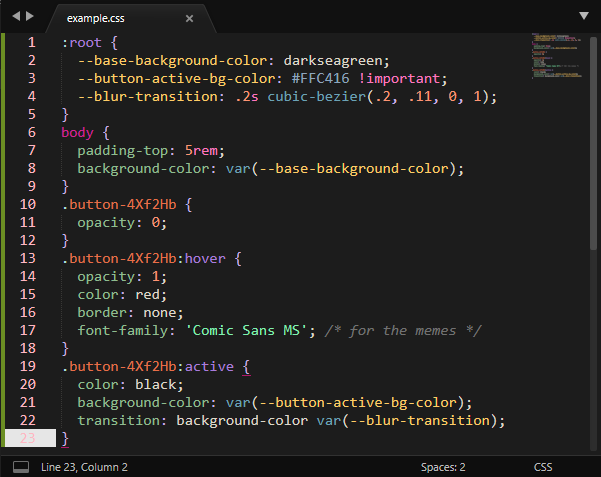
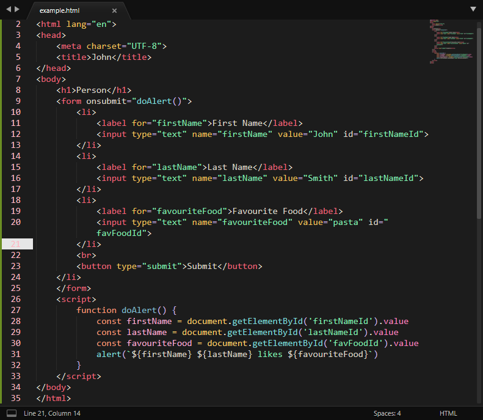
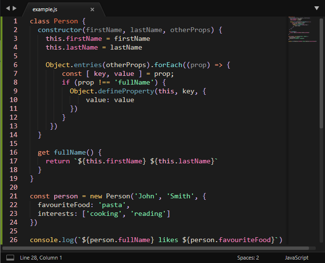
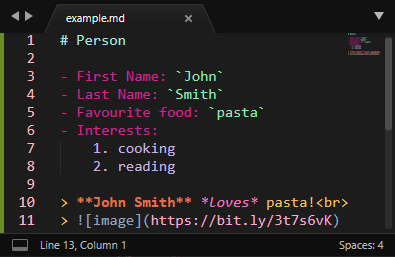
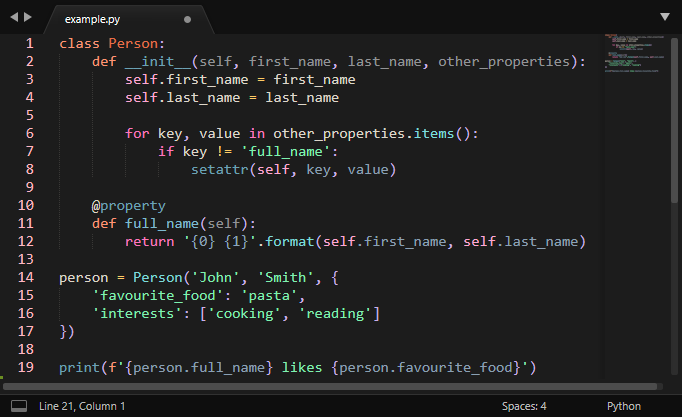

# midnight candy
A sleek, dark pastel colour scheme for Sublime Text 3 heavily based on [the Search Lights theme for VSCode](https://marketplace.visualstudio.com/items?itemName=radiolevity.search-lights 'Thanks, radiolevity!'). 
**Acknowledgements**: Huge thanks to radiolevity of course for inspiring me to make this, and to Gamma for helping me name it. :)

## Installation
At the moment this colour scheme is not available through Sublime Package Control, so manual installation is required.

- Copy the contents of [`MidnightCandy`](MidnightCandy.sublime-color-scheme)
- Navigate to `Preferences > Browse Packages`
- Open `Themes` folder (or create one if it doesn't exist) and create new file named `Midnight Candy.sublime-color-scheme`
- Paste the contents into this file and save it

To use this theme, simply open `Preferences > Color Scheme` and choose `Midnight Candy` from the list.

## Previews

### CSS

### HTML

### JavaScript

### Markdown

### Python

## License
This repository's code is licensed under the MIT license, see [`LICENSE.md`](LICENSE.md) for more details.